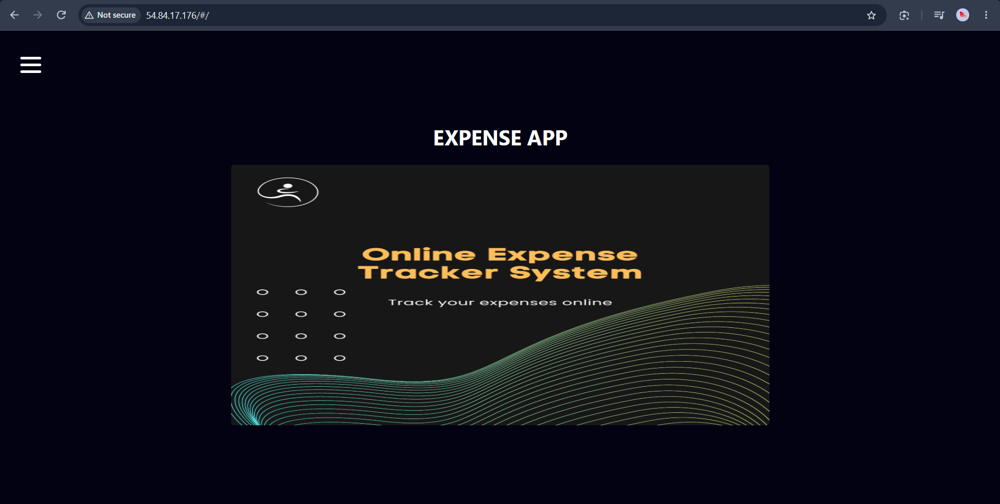
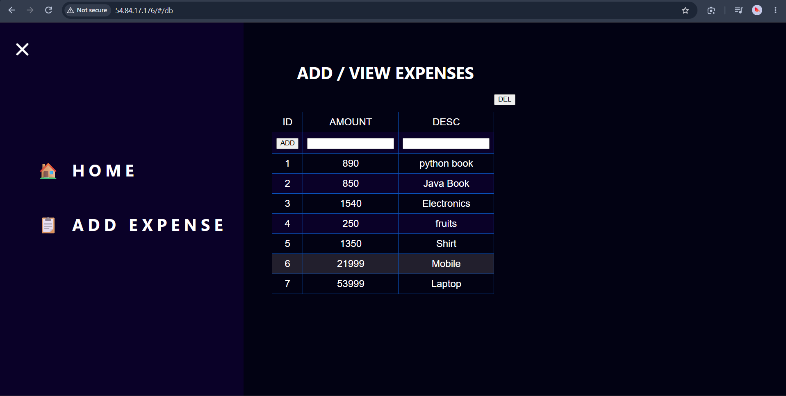
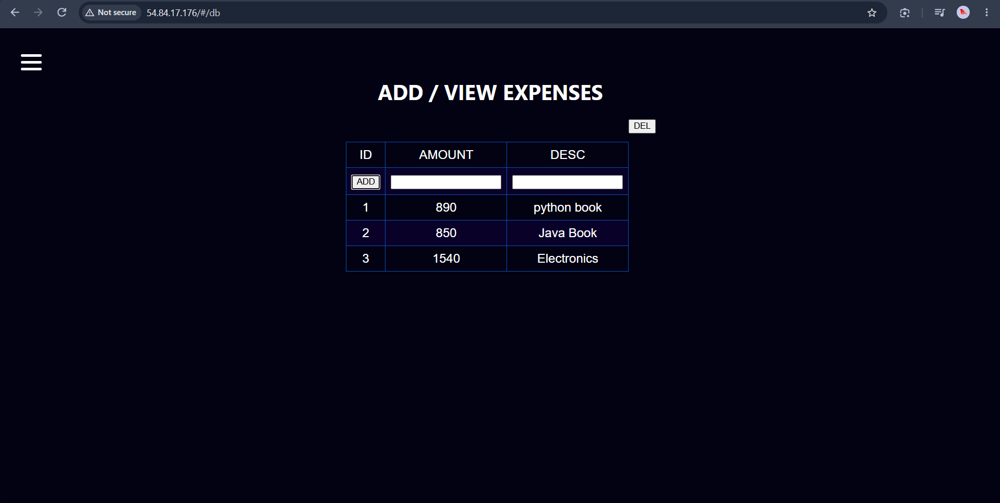

# Expense Management Application

A full-stack Expense Management Application deployed on AWS using a three-tier architecture with separate EC2 instances for the frontend, backend, and database.

## Architecture

```text
                        Internet
                           |
                           v
                  +------------------+
                  |   Frontend EC2   |
                  |  Expense App UI  |
                  +--------+---------+
                           |
                      Private IP
                           |
                           v
                  +------------------+
                  |    Backend EC2   |
                  |    REST API      |
                  +--------+---------+
                           |
                      Private IP
                           |
                           v
                  +------------------+
                  |   Database EC2   |
                  |     Database     |
                  +------------------+
```

## Project Overview

The application is deployed on three separate AWS EC2 instances:

* **Frontend EC2** – Hosts the frontend application.
* **Backend EC2** – Runs the backend application and APIs.
* **Database EC2** – Hosts the application database.
* Frontend communicates with the backend using the backend server's private IP address.
* Backend communicates with the database using the database server's private IP address.
* AWS Security Groups are configured to allow the required communication between the servers.

## Technologies Used

* AWS EC2
* Linux
* Git & GitHub
* Frontend: React
* Backend: Node.js / Express.js
* Database: MongoDB
* Private IP Networking
* AWS Security Groups

## Project Structure

```text
expense-app/
│
├── frontend/
│   └── Frontend application source code
│
├── backend/
│   └── Backend application source code
│
├── app-demo/
│   └── Application screenshots
│
├── .gitignore
└── README.md
```

## AWS Deployment

### 1. EC2 Infrastructure

Created three separate EC2 instances for the application:

```text
Frontend EC2
Backend EC2
Database EC2
```

Each server was configured with the required software and dependencies.

### 2. Database Server

The database was installed and configured on the Database EC2 instance.

The backend connects to the database using the database server's private IP address.

```text
Backend EC2
     |
     | Private IP
     v
Database EC2
```

### 3. Backend Server

The backend application was deployed on the Backend EC2 instance.

The backend was configured to connect to the database using its private IP address.

```text
Database Host = <DATABASE_PRIVATE_IP>
```

### 4. Frontend Server

The frontend application was deployed on the Frontend EC2 instance.

The frontend was configured to communicate with the backend using the backend server's private IP address.

```text
Backend URL = http://<BACKEND_PRIVATE_IP>:<PORT>
```

### 5. Server Communication

The final application flow is:

```text
User
 |
 v
Frontend EC2
 |
 | Private IP
 v
Backend EC2
 |
 | Private IP
 v
Database EC2
```

The application was tested after deployment to verify communication between all three tiers.

## How to Run Locally

### Clone the Repository

```bash
git clone <YOUR_GITHUB_REPOSITORY_URL>
cd expense-app
```

### Run Frontend

```bash
cd frontend
npm install
npm start
```

### Run Backend

Open another terminal:

```bash
cd backend
npm install
npm start
```

Make sure the database is running and the backend database configuration is correctly configured before starting the application.

## AWS Deployment Steps

The general deployment process used for this project was:

```text
1. Create three EC2 instances
          ↓
2. Configure Frontend EC2
          ↓
3. Configure Backend EC2
          ↓
4. Configure Database EC2
          ↓
5. Configure required Security Group rules
          ↓
6. Configure private IP communication
          ↓
7. Deploy frontend application
          ↓
8. Deploy backend application
          ↓
9. Configure database connection
          ↓
10. Test the complete application
```

The application was deployed and tested using SSH-based server access and terminal tools.

## Application Demo

Screenshots of the deployed application are available in the `app-demo` folder.

### Application Dashboard



### Add Expense



### Expense Details



> The screenshots demonstrate the application after successful AWS deployment. The EC2 instances may not remain continuously running because AWS EC2 resources can incur charges.

## Key DevOps / AWS Work

* Created and configured separate EC2 instances for frontend, backend, and database.
* Deployed the application across a three-tier AWS architecture.
* Configured private IP communication between frontend and backend.
* Configured private IP communication between backend and database.
* Configured AWS Security Groups for required network communication.
* Connected and tested the application across multiple EC2 instances.
* Used Git, Git Bash, and SSH-based server management for deployment.

## Security Considerations

Sensitive information is not included in this repository.

The following should never be committed to GitHub:

```text
.env
.env.*
*.pem
*.key
AWS Access Keys
AWS Secret Keys
Database Passwords
Private Credentials
```

Private IP addresses and credentials used during deployment are not included in this repository.

## Future Improvements

* Containerize the application using Docker.
* Automate AWS infrastructure provisioning using Terraform.
* Implement CI/CD using Jenkins.
* Add DevSecOps security scanning.
* Implement application monitoring and centralized logging.
* Explore Kubernetes-based deployment.

## Author

**Vijay Kumar**

DevOps Engineer | AWS | Docker | Kubernetes | Terraform | CI/CD | DevSecOps
